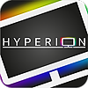

# ioBroker.hyperion-ng2

**Tests:** 

## hyperion-ng2 adapter for ioBroker

Connect to hyperion.ng server. Hyperion Projekt https://hyperion-project.org/forum/

Der Adapter sucht automatisch kurz nach dem Adapterstart nach verfügbaren Hyperion Servern im lokalen Netz.
Bei fund versucht er sich zu verbinden, im Falle das eine Login nötig ist, fragt er ein Token an.
Dieses führt zu einem Popup auf der WebUI von Hyperion das man bestätigen muß. 

States sind noch nicht benannt, Kommandos soweit mir nützlich eingebaut.

Wenn den niemand ausser mir nutzt ist der soweit fertig für mich, falls doch bitte im Forum oder hier melden.
Dann mache ich ihn noch schön.

## Changelog
<!--
	Placeholder for the next version (at the beginning of the line):
	### **WORK IN PROGRESS**
-->
### **WORK IN PROGRESS**
* (ticaki) added controls.system

### 0.0.3 (2025-01-01)
* (ticaki) add info.connection for adapter and device

### 0.0.3-alpha.0 (2025-01-01)
* (ticaki) initial release

### 0.0.2-alpha.0 (2025-01-01)
* (ticaki) initial release

## License
MIT License

Copyright (c) 2025 ticaki <github@renopoint.de>

Permission is hereby granted, free of charge, to any person obtaining a copy
of this software and associated documentation files (the "Software"), to deal
in the Software without restriction, including without limitation the rights
to use, copy, modify, merge, publish, distribute, sublicense, and/or sell
copies of the Software, and to permit persons to whom the Software is
furnished to do so, subject to the following conditions:

The above copyright notice and this permission notice shall be included in all
copies or substantial portions of the Software.

THE SOFTWARE IS PROVIDED "AS IS", WITHOUT WARRANTY OF ANY KIND, EXPRESS OR
IMPLIED, INCLUDING BUT NOT LIMITED TO THE WARRANTIES OF MERCHANTABILITY,
FITNESS FOR A PARTICULAR PURPOSE AND NONINFRINGEMENT. IN NO EVENT SHALL THE
AUTHORS OR COPYRIGHT HOLDERS BE LIABLE FOR ANY CLAIM, DAMAGES OR OTHER
LIABILITY, WHETHER IN AN ACTION OF CONTRACT, TORT OR OTHERWISE, ARISING FROM,
OUT OF OR IN CONNECTION WITH THE SOFTWARE OR THE USE OR OTHER DEALINGS IN THE
SOFTWARE.